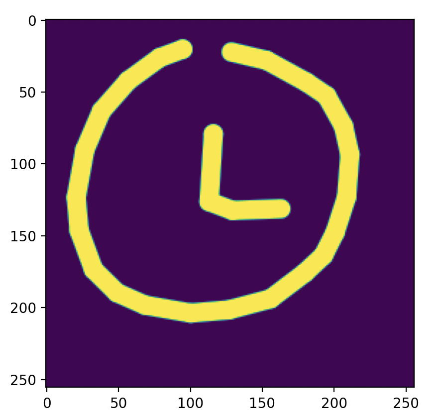

# Sketch Generation #
The work in this repo is based upon research produced by Google Brain "[A Neural Representation of Sketch Drawings](https://arxiv.org/pdf/1704.03477)". Notable differences include
* Replacement of HyperLSTM backbone with multi-headed transformer layers
* Replacement of NLLLoss with focal loss to more quickly learn underrepresented pen states
* Replacement of exponential activation of sigma variables with ELU to promote GMM training stability

## Lessons Learned ##
1. Stably training gaussian mixture models is hard. Moreover, training on autoregressive sequences of gaussian mixture models is even harder.

The first aspect that makes GMM sequence models difficult to train is the tendency of GMMs to collapse onto sample points and produce exploding gradients (see [GMMPyTorch](https://github.com/kylesayrs/GMMPytorch)). The original authors partially address this by imposing a `gradient_clip` parameter which limits the maximum magnitude of any one gradient step. While this technique is effective, I found that the model still produced extreme positive loss spikes which made analysis difficult. In addition to imposing gradient clipping, I replace the exponential activation, which is subject to gradient explosion on both sides, with ELU plus a very small constant to the diagonal sigmas which limits the minimum standard deviation variable, thereby limiting the collapsing effect.

The second difficult aspect is the autoregressive nature of the sequence model. Like any autoregressive model, this model is prone to hallucinations if predictions are produced which are not within the dataset distribution. To limit this effect, a temperature parameter is required during inference time to reduce the chance of positions and pen states outside of the expected distribution.

2. Focal loss over NLLLoss

The original paper uses a softmax activation followed by NLLLoss to learn the pen state classes. While this technique works, I found that I was able to learn the minority class (pen_up) much faster using focal loss with a gamma of value of 2.

3. Train a toy dataset first

I found that my best work was done when training using using a toy dataset, rather than starting with the full dataset. Training on just a single sample helped me catch bugs and served as a basis for expected model output outside of just loss alone. 

## Future work ##
One notable flaw in the original architecture is that the pen state and pen position are predicted independently of one another. This can lead to situations where the model infers a split pen position  distribution which attempts to match both the pen being raised and the pen continuing to be drawn. This could be resolved by either coupling a new pen distribution to each component of the gaussian distribution or explicitly conditioning the GMM components on the pen prediction.
